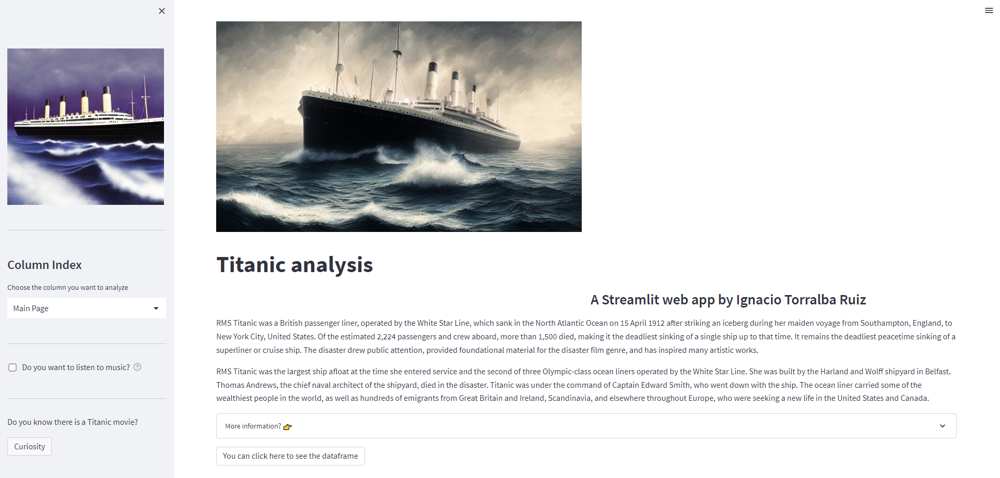
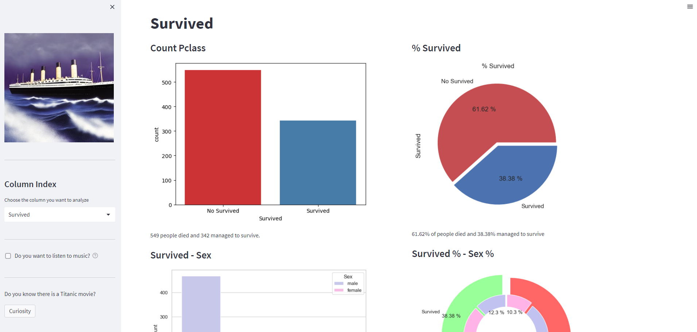

<!DOCTYPE html>
<html>
<head>
  <title>Bandera de Gran Bretaña</title>
</head>
<body>
  
Aquí está el emoticono de la bandera de Gran Bretaña: &#127465;

</body>
</html>
  
# TITANIC
Basic Data Analysis of Titanic Passenger Dataset 

## Introduction
Hello everybody.
This is my first project in the process to become a Data Analyst, it's also my first time on Github.
In the future I will upload more cool things.

## Explication
The project consists of using a csv file of the Titanic and from there cleaning the data and drawing graphs on the data.

## Streamlit
I use Streamlit as presentation mode to be able to see the graphics of the titanic.

